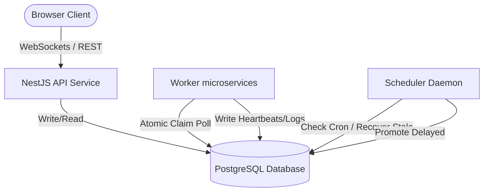
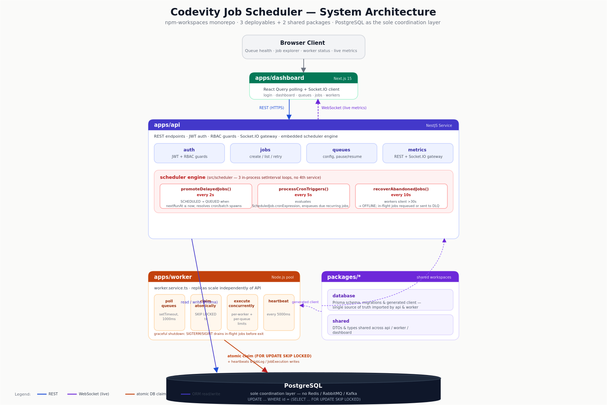

# Architecture

## System overview

The scheduler is split into three independently deployable services sharing two internal packages, all managed as an npm-workspaces monorepo.





*Scalable original: [`diagrams/architecture-diagram.svg`](diagrams/architecture-diagram.svg)*

| Component | Responsibility |
|---|---|
| `apps/api` | REST endpoints, JWT auth, RBAC, Socket.IO metrics stream, and the background **scheduler engine** (delayed-job promotion, cron triggers, stale-worker recovery) |
| `apps/worker` | Polls queues, atomically claims jobs, executes them concurrently, writes heartbeats, handles graceful shutdown |
| `apps/dashboard` | Next.js 15 dashboard — queue health, worker status, job explorer, live metrics |
| `packages/database` | Prisma schema, migrations, and generated client shared by API and worker |
| `packages/shared` | DTOs and types shared across services |

## Why this split

- **API and worker are separate deployables** so worker capacity can scale independently of request traffic — you can run many worker replicas behind one API instance.
- **The scheduler engine lives inside the API process** (not a fourth service) because it's lightweight (three `setInterval` loops) and doesn't need independent scaling; see `apps/api/src/scheduler`.
- **`packages/database` is the single source of truth for the schema** — both API and worker import the same generated Prisma client, so there's no drift between what each service thinks the schema looks like.

## Key design decisions

### 1. Atomic job claiming
To guarantee exactly-once execution without a dedicated locking server (Redis Redlock, ZooKeeper, etc.), claiming uses PostgreSQL row-level locking directly:

```sql
UPDATE "Job"
SET "status" = 'CLAIMED', "workerId" = $1, "attemptsMade" = "attemptsMade" + 1, "updatedAt" = NOW()
WHERE "id" = (
  SELECT "id"
  FROM "Job"
  WHERE "status" = 'QUEUED'
    AND "queueId" = $2
    AND "nextRunAt" <= NOW()
  ORDER BY "priority" DESC, "nextRunAt" ASC
  LIMIT 1
  FOR UPDATE SKIP LOCKED
)
RETURNING *;
```

- **`FOR UPDATE`** takes an exclusive row lock, so no other transaction can read or write that row until commit/rollback.
- **`SKIP LOCKED`** lets concurrent workers skip a locked row instead of blocking, avoiding wait loops or double execution.
- Because the claim is an `UPDATE` inside the same transaction that changes status from `QUEUED` to `CLAIMED`, once it commits, no other worker's `WHERE status = 'QUEUED'` query can match that row again.

See `apps/worker/src/worker.service.ts` (`claimJobAtomic`).

### 2. Global concurrency limits
Before claiming, each worker counts currently-running jobs for a queue and skips claiming if the queue is already at its configured `concurrencyLimit` — this bounds parallelism per queue across the whole worker fleet, not just per-process, without needing a distributed semaphore.

### 3. Stale worker recovery
The scheduler daemon (`apps/api/src/scheduler/scheduler.service.ts`) polls for workers whose `updatedAt` heartbeat is older than 30 seconds, marks them `OFFLINE`, and either requeues their in-flight jobs (if attempts remain) or moves them to the Dead Letter Queue.

### 4. Retry strategy
Three backoff types — fixed, linear, exponential — are computed in `handleJobFailure` based on the job's `RetryPolicy`. See `docs/DESIGN_DECISIONS.md` for the trade-offs behind this choice.
