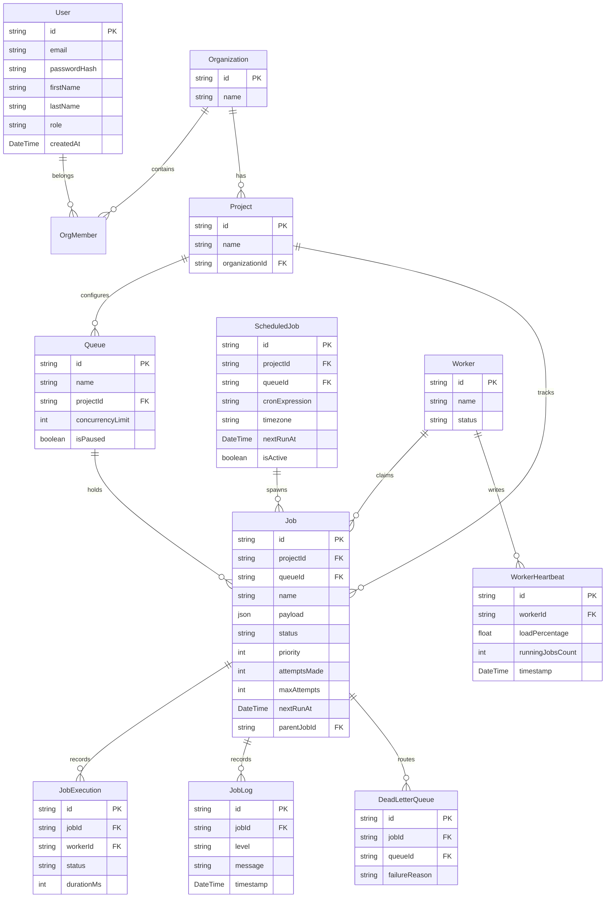
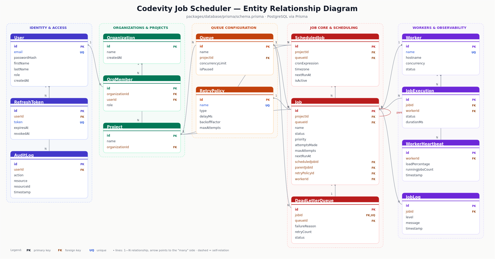

# Database Design

Full schema lives at `packages/database/prisma/schema.prisma` — this doc explains the shape and the reasoning behind it. Regenerate the client after any schema change with `npm run db:generate`.

## ER diagram





*Scalable original: [`diagrams/er-diagram.svg`](diagrams/er-diagram.svg)*

## Notable decisions

- **Multi-tenancy via `Organization` → `OrgMember` → `User`**, so a user can belong to multiple orgs with different roles rather than one role per user globally.
- **`Job.parentJobId` self-relation** implements simple workflow dependencies — a child job is created as `SCHEDULED` and only promoted to `QUEUED` once its parent completes (see `promoteChildJobs` in the worker).
- **Composite index `(status, queueId, priority DESC, nextRunAt ASC)` on `Job`** — this is the exact predicate + sort order the atomic-claim query uses, so claiming stays an index scan even as the jobs table grows.
- **Separate `JobLog` and `JobExecution` tables** — `JobExecution` is one row per attempt (for metrics/duration), `JobLog` is an append-only human-readable trail (for the dashboard's log viewer). Keeping them separate avoids overloading one table with two different access patterns.
- **`onDelete: Cascade` vs `SetNull`** — child records that have no meaning without their parent (e.g. `JobExecution`, `JobLog`) cascade-delete; references that should survive deletion of the referenced row (e.g. `Job.retryPolicyId`, `Job.workerId`) use `SetNull` so a deleted retry policy or offline worker doesn't destroy job history.
- **`RefreshToken` and `AuditLog`** exist beyond the brief's minimum entity list — refresh tokens support JWT rotation, and the audit log gives a place to record privileged actions (queue pause/resume, manual retries) for RBAC-relevant traceability.

## Migrations

Migrations live in `packages/database/prisma/migrations/`. To create a new one after editing the schema:

```bash
npm run db:migrate --workspace=packages/database
```
